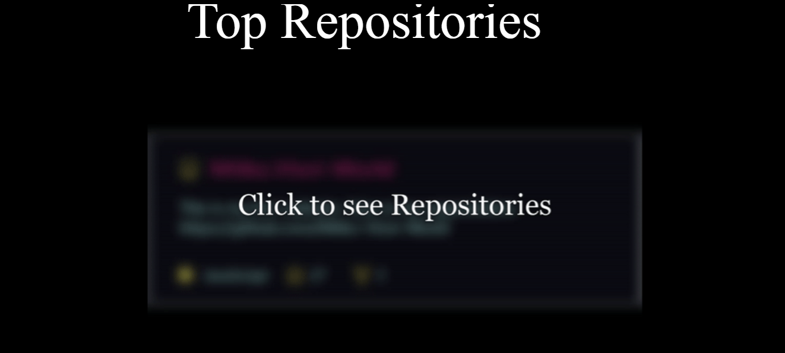
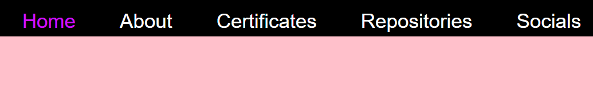
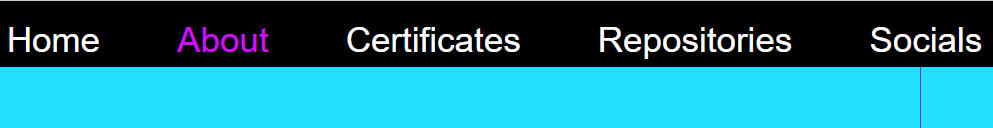
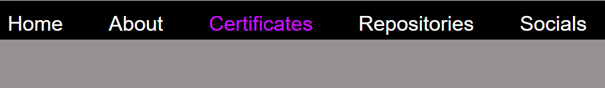
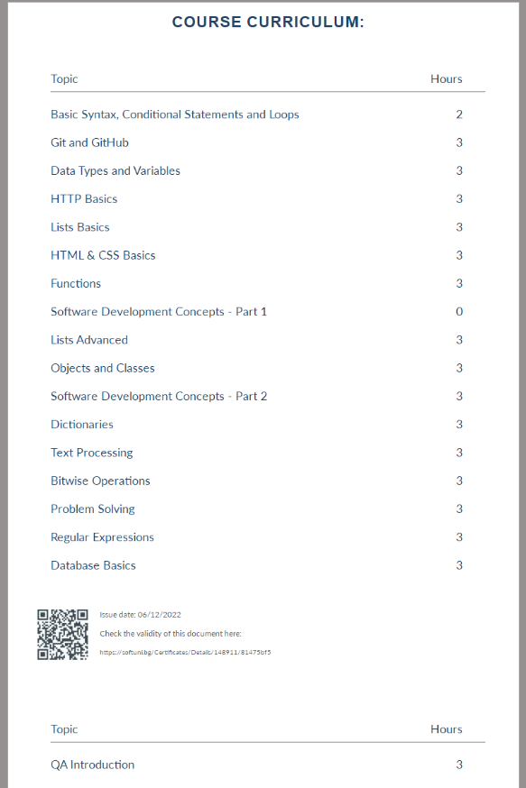

# <a href="https://mitkovtori.github.io/">MitkoVtori.github.io</a>
#### This is my web CV/Portfolio.

## Explanations

-    [JavaScript](#JavaScript)
      -  [Show and Hide Repositories](#ShowHideRepos)
      -  [Change Buttons Color](#ChangeButtonColor)
      -  [Switch Images](#switchimage)
-    [CSS3](#CSS)
      -  [On mouseover effect](#onhover)
      -  [Socials](#socials)
      -  [Rest of the style](#style)

# JavaScript
#### ShowHideRepos
This is a function that onclick shows and hides list of my most **popular repositories**
<details>
 <summary><b>🖼 Show Picture</b></summary>


<br>
<br>


</details>

```JavaScript
function ShowHideRepos() {
  var x = document.getElementById("repositories");
  if (x.style.display === "none") {
    x.style.display = "block";
  } else {
    x.style.display = "none";
  }
}
```

#### ChangeButtonColor
This functions change the button color of the link buttons in the **sections** section.
<details>
 <summary><b>🔍 Show <strong>sections</strong> section</b></summary>

```html
<div id="sections">
        <p>
            <a href="#home"><button class="hover" onclick="ChangeHomeButtonColor()" id="homeButton" style="background: black; color: white; margin: 0; margin-left: 21%">Home</button></a>
            <a href="#About"><button class="hover" onclick="ChangeAboutButtonColor()" id="AboutButton" style="background: black; color: white; margin-left: 3%">About</button></a>
            <a href="#certificates"><button class="hover" onclick="ChangeCertificatesButtonColor()" id="certificatesButton" style="background: black; color: white; margin-left: 3%">Certificates</button></a>
            <a href="#TopRepos"><button class="hover" onclick="ChangeRepoButtonColor()" id="RepoButton" style="background: black; color: white; margin-left: 3%">Repositories</button></a>
            <a href="#socials"><button class="hover" onclick="ChangeSocialsButtonColor()" id="SocialsButton" style="background: black; color: white; margin-left: 3%">Socials</button></a>
        </p>
    </div>
```

</details>
<br>
<details>
 <summary><b>🖼 Show Pictures</b></summary>





</details>

```JavaScript

function ChangeHomeButtonColor() {
 document.getElementById("homeButton").style.color = "#D00FFF";
 document.getElementById("AboutButton").style.color = "white";
 document.getElementById("certificatesButton").style.color = "white";
 document.getElementById("RepoButton").style.color = "white";
 document.getElementById("SocialsButton").style.color = "white";
}

function ChangeAboutButtonColor() {
 document.getElementById("AboutButton").style.color = "#D00FFF";
 document.getElementById("certificatesButton").style.color = "white";
 document.getElementById("RepoButton").style.color = "white";
 document.getElementById("SocialsButton").style.color = "white";
 document.getElementById("homeButton").style.color = "white";
}

function ChangeCertificatesButtonColor() {
 document.getElementById("certificatesButton").style.color = "#D00FFF";
 document.getElementById("AboutButton").style.color = "white";
 document.getElementById("RepoButton").style.color = "white";
 document.getElementById("SocialsButton").style.color = "white";
 document.getElementById("homeButton").style.color = "white";
}

function ChangeRepoButtonColor() {
 document.getElementById("RepoButton").style.color = "#D00FFF";
 document.getElementById("SocialsButton").style.color = "white";
 document.getElementById("homeButton").style.color = "white";
 document.getElementById("AboutButton").style.color = "white";
 document.getElementById("certificatesButton").style.color = "white";
}

function ChangeSocialsButtonColor() {
 document.getElementById("SocialsButton").style.color = "#D00FFF";
 document.getElementById("RepoButton").style.color = "white";
 document.getElementById("homeButton").style.color = "white";
 document.getElementById("AboutButton").style.color = "white";
 document.getElementById("certificatesButton").style.color = "white";
}
```

#### switchimage
Changes the image when mouseover
<details>
 <summary><b>🖼 Show Picture</b></summary>


<br>
<br>


</details>

```JavaScript

// On hover, shows the background of the certificate.

function certificateHover(element) {
  element.setAttribute('src', 'images/Programming Fundamentals with Python - September 2022 - CURRICULUM.png');
}

// When mouse not on hover, shows the certificate

function certificateUnhover(element) {
  element.setAttribute('src', 'images/Programming Fundamentals with Python - September 2022 - Certificate.png');
}

// On hover, shows the repo card of this webpage.

function streakStatsHover(element) {
  element.setAttribute('src', 'https://github-readme-stats.vercel.app/api/pin/?username=MitkoVtori&theme=codeSTACKr&repo=MitkoVtori.github.io')
}

// When mouse not on hover, shows GitHub Streak Stats.

function streakStatsUnhover(element) {
  element.setAttribute('src', 'https://streak-stats.demolab.com?user=MitkoVtori&theme=highcontrast')
}
```

# CSS
#### onhover
This makes pictures, text & buttons bigger on mouseover
```css

.hover {
  transform: scale(1);
  transition: transform .5s;
}
.hover:hover {
  transform: scale(1.2);
}
```

#### socials


```css
@import url(https://cdnjs.cloudflare.com/ajax/libs/font-awesome/4.6.3/css/font-awesome.css);

.socialmedia {
    background: #1C1A1A;
    width: 100%;
}
#socials {
    margin-left: 20%;
}

.social-icons {
  padding: 0;
  list-style: none;
  margin: 1em;
  font-size: 450%;
}
.social-icons li {
  display: inline-block;
  margin: 0.15em;
  position: relative;
  font-size: 1.2em;
  margin-top: 12%;
}
.social-icons i {
  color: #93D6E2;
  position: absolute;
  top: 21px;
  left: 21px;
  transition: all 265ms ease-out;
  margin-top: 10%;
  margin-left: 12%;
}
.social-icons a {
  display: inline-block;
}
.social-icons a:before {
  transform: scale(1);
  -ms-transform: scale(1);
  -webkit-transform: scale(1);
  content: " ";
  width: 150px;
  height: 150px;
  border-radius: 100%;
  display: block;
  background: linear-gradient(45deg, #ff003c, #c648c8);
  transition: all 265ms ease-out;
}
.social-icons a:hover:before {
  transform: scale(0);
  transition: all 265ms ease-in;
}
.social-icons a:hover i {
  transform: scale(2.2);
  -ms-transform: scale(2.2);
  -webkit-transform: scale(2.2);
  color: red;
  background: -webkit-linear-gradient(45deg, #ff003c, #c648c8);
  -webkit-background-clip: text;
  -webkit-text-fill-color: transparent;
  transition: all 265ms ease-in;
}
.social-icons a.social-square:before {
  background: linear-gradient(45deg, #7b00e0, #ae31d9);
  border-radius: 10%;
}
.social-icons a.social-square:hover:before {
  transform: rotate(-180deg);
  -ms-transform: rotate(-180deg);
  -webkit-transform: scale(-180deg);
  border-radius: 100%;
}
.social-icons a.social-square:hover i {
  transform: scale(1.6);
  -ms-transform: scale(1.6);
  -webkit-transform: scale(1.6);
  color: red;
  transform: scale(1.6);
  -webkit-text-fill-color: red;
}
```

### style
This is the rest of the style. It has comments with explanations in it.
```css
html {
    background: black;
}
body {
    background: pink;
}
#sections {
    background: black;
    margin: 0;
    position: fixed; /* That makes the section follow you when you scroll */
    top: 0;
    z-index: 999; /* This make the section to be above everything, instead of being behind the pictures. */
    height: 7%;
    width: 100%;
}
    #sections button {
        font-size: 35px;
    }

.home {
    background: pink;
}
#GitHub {
    margin-left: 75%;
    margin-top: 5%;
}
.About {
    background: #22DEFF;
}
#About {
    font-size: 185%;
    color: #8A3090;
}
#Linkedin {
    margin-top: 5%;
    margin-left: 19%;
}
.certificates {
    background: #959191;
}
.TopRepos {
    background: black;
}
#TopRepos {
    margin-left: 34%;
}
.expandable {
      /* 
        This is the list of repositories, the "overflow" is set to hidden,
        So until you don't click on a certain button the repos won't show
     */

      overflow: hidden;
      line-height: 90%;
      transition: all .5s ease-in-out;
      height: 0;
     }

     .expandable:target {
        height: 100%;
    }
#repositories {
    background: white;
}
#StackOverflow {
    margin-top: 10%;
    margin-left: 40%;
}
#topSecret {
    background: gray;
    height: 500px;
}
#topSecretButton {
    transition: .5s;
    background-color: #E9BE0E;
    color: #424B4D;
    border: 75;
    height: 14%;
    width: 15%;
    margin-top: 12%;
    margin-left: 7%;
}
#topSecretButton:hover {
    /* Here we hide the button on mouseover */

    background: gray;
    border: 0;
    color: gray;
    transition: 0s 0s;
}
#hiddenText {
    display: none;
}
#topSecretButton:focus + #hiddenText {
    display: block;
}
#topSecretButton:hover span {
  display: none
}
#streak {
    float:right;
    margin-right: 25%;
    margin-top: 8%;
    width: 35%;
}
#source {
    margin-top: 9%;
    margin-left: 0.85%;
    font-size: 125%;
}
#source button {
    background: gray;
    border: 0;
    font-size: 100%;
    color: #9C00F0;
}
```
